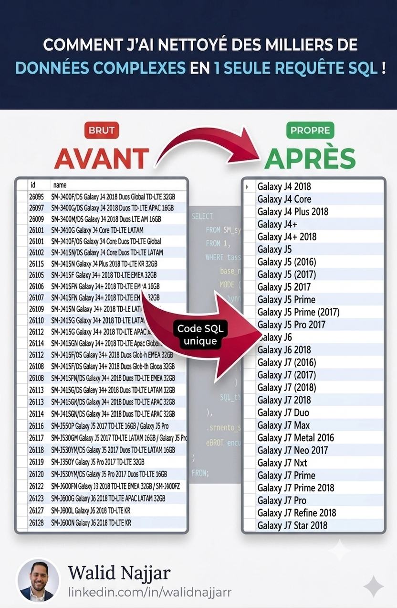
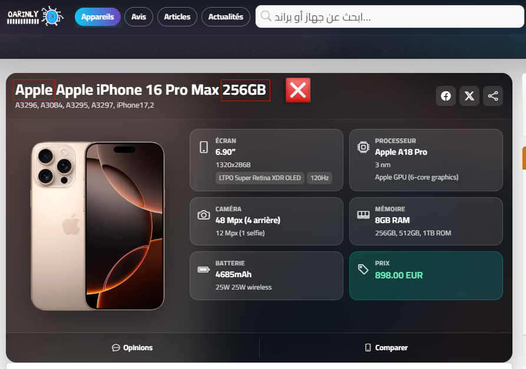
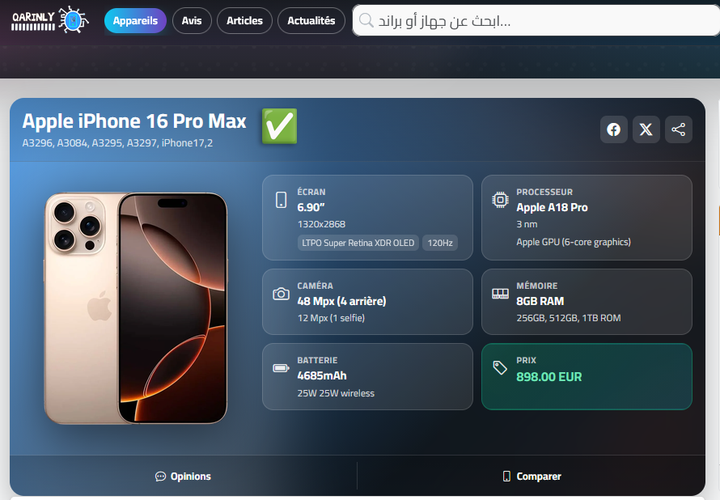
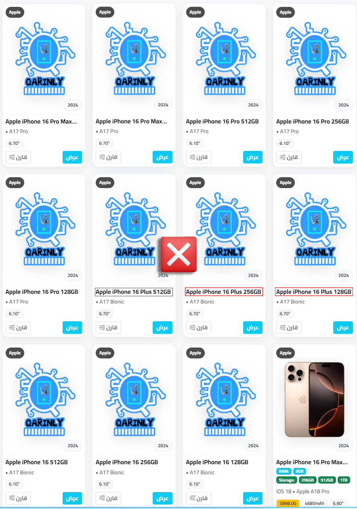

# 🧹 Nettoyage et Déduplication de la Base de Données QARINLY



## 📌 Contexte du projet

**QARINLY** est un site web (qarinly.com) qui référence des milliers de téléphones et appareils mobiles (Apple, Samsung, Huawei, LG, Xiaomi, Honor...) stockés dans une base de données MySQL (`u727898215_qarinlydb`).

Les données provenaient de sources brutes (imports GSMArena / fournisseurs) et contenaient énormément de **doublons** et de **noms mal formatés** : codes régionaux, tailles de stockage, versions, codes modèles... Le tout mélangé dans un seul champ `name`.

### Le problème visible pour l'utilisateur final

Avant nettoyage, un même appareil apparaissait plusieurs fois sur le site avec des noms différents, et certaines fiches affichaient des noms doublés ou incohérents :

| Avant | Après |
|---|---|
|  |  |
|  |  |

On voit clairement le nom **"Apple Apple iPhone 16 Pro Max 256GB"** (doublé + taille de stockage incluse) transformé en **"Apple iPhone 16 Pro Max"**, propre et unique.

---

## 🎯 Objectif

Écrire **une seule requête SQL réutilisable** capable de :
1. Nettoyer automatiquement les noms des appareils (suppression des infos parasites).
2. Identifier les doublons créés par ce nettoyage.
3. Supprimer les doublons en ne gardant qu'une seule fiche par appareil.
4. Appliquer le nom propre de façon définitive, sans casser les données existantes (clés étrangères, contraintes UNIQUE...).

Fichier source : [`NETTOYAGE_DATABASE_QARINLY.sql`](./NETTOYAGE_DATABASE_QARINLY.sql)

---

## 🛠️ Étapes du script SQL

### 1. Sauvegarde de sécurité

```sql
CREATE TABLE devices_backup_ZENPHONE AS SELECT * FROM devices;
```

Avant toute modification destructive (UPDATE / DELETE), on crée une copie complète de la table `devices`. C'est une étape obligatoire : en cas d'erreur dans le nettoyage, on peut restaurer les données originales sans rien perdre.

### 2. Ajout d'une colonne temporaire `base_name`

```sql
ALTER TABLE devices ADD COLUMN base_name VARCHAR(255);
```

On ne modifie jamais directement la colonne `name` en premier. On calcule d'abord le nom nettoyé dans une nouvelle colonne `base_name`, ce qui permet de **vérifier le résultat avant de l'appliquer définitivement**.

### 3. Nettoyage du nom avec des `REGEXP_REPLACE` imbriqués

```sql
UPDATE devices
SET base_name = TRIM(
    REGEXP_REPLACE(
    REGEXP_REPLACE(
    ...
    REGEXP_REPLACE(name,
        '\\s+[0-9]+(GB|TB)\\b', ''),                    -- 1. supprime la capacité de stockage (128GB, 1TB...)
        '\\s+(NA|SA|VN|AU|...)\\b', ''),                 -- 2. supprime les codes de région/pays (NA, EU, VN...)
        '\\s+V(?![9]{1}\b)[0-8]{1}\\b', ''),             -- 3. supprime les suffixes courts type V1, V2, V6
        '\\s+V(?![9]{1}\b)[0-9]{3,9}\\b', ''),           -- 4. supprime les suffixes longs type V100, V2024
        '\\s+(D|E|P|V)[0-9]{3}\\b', ''),                 -- 5. supprime les codes modèles (D123, E456...)
        '\\bApple\\b', ''),                              -- 6. supprime les doublons du mot marque
        '\\s+version [A-Z0-9]{0,9}(?: [A-Z])*\\b', ''),  -- 7. supprime la mention "version XXX"
        '[[:space:]]*/[[:space:]]*$', ''),               -- 8. supprime un "/" en fin de chaîne
        '[[:space:]]*/ /[[:space:]]*$', ''),             -- 9. supprime un motif "/ /" invalide
        '\\s*/+\\s*', ' ')                               -- 10. remplace les "/" restants par un espace
)
WHERE brand_id = 6;
```

**Pourquoi imbriquer 10 `REGEXP_REPLACE` ?**
Chaque source de "bruit" dans les noms est différente (taille, région, version, code technique...). MySQL ne permet pas d'appliquer plusieurs regex en une seule expression : on les enchaîne donc en cascade, chaque étape nettoyant un type de bruit précis, du plus spécifique au plus général. Le `TRIM()` final enlève les espaces superflus laissés par les suppressions.

> Ce même bloc est utilisé deux fois : une première fois en `SELECT` (pour prévisualiser le résultat sans rien modifier), puis en `UPDATE` (pour l'enregistrer réellement dans `base_name`).

### 4. Vérification des doublons créés par le nettoyage

```sql
SELECT base_name, COUNT(*) AS total, MIN(id) AS keep_id
FROM devices
WHERE brand_id = 6 AND base_name IS NOT NULL
GROUP BY base_name
HAVING COUNT(*) > 1
ORDER BY total DESC;
```

Une fois les noms nettoyés, plusieurs lignes qui semblaient différentes ("Galaxy J4 2018 Duos Global 32GB" et "Galaxy J4 2018 Duos APAC 16GB") deviennent identiques ("Galaxy J4 2018"). Cette requête liste tous les `base_name` qui apparaissent plusieurs fois, et repère le plus ancien identifiant (`MIN(id)`) à conserver.

### 5. Suppression des doublons

```sql
DELETE d FROM devices d
JOIN (
    SELECT base_name, MIN(id) AS keep_id
    FROM devices
    WHERE brand_id = 6 AND base_name IS NOT NULL
    GROUP BY base_name
) k ON d.base_name = k.base_name
WHERE d.brand_id = 6
  AND d.base_name IS NOT NULL
  AND d.id <> k.keep_id;
```

Pour chaque groupe de doublons, on garde uniquement la ligne dont l'`id` correspond au `keep_id` (le plus petit id, donc la fiche la plus ancienne), et on supprime toutes les autres. Cette étape a nécessité de résoudre au préalable des erreurs de **contrainte de clé étrangère** (table `device_comments` liée à `devices`) et des collisions d'**index UNIQUE** causées par des espaces invisibles en fin de nom.

### 6. Application du nom propre

```sql
UPDATE devices
SET name = base_name
WHERE brand_id = 6 AND base_name IS NOT NULL;
```

Une fois les doublons supprimés, on remplace définitivement le nom original par le nom nettoyé.

### 7. Suppression de la colonne temporaire

```sql
ALTER TABLE devices DROP COLUMN base_name;
```

`base_name` n'était qu'un outil de travail intermédiaire. Une fois le nettoyage terminé et validé, elle est supprimée pour garder une structure de table propre.

### 8. Vérification finale

```sql
SELECT devices.name AS device_name, devices.id, devices.brand_id, brands.name AS name_brand
FROM devices
JOIN brands ON brands.id = devices.brand_id
WHERE devices.brand_id = 6;
```

Dernière étape : un contrôle visuel des résultats en jointant la table `brands`, pour confirmer que chaque appareil a bien un nom propre et une marque correcte.

---

## 🔁 Méthodologie appliquée à chaque marque

Ce processus (backup → `base_name` → détection doublons → suppression → renommage → nettoyage colonne) a été répété marque par marque (`brand_id`) pour : **Apple, Samsung, Huawei, LG, Xiaomi, Honor**, en adaptant à chaque fois les motifs regex aux spécificités de nommage de chaque marque.


---

## ✅ Résultats

- Des milliers de fiches en double supprimées automatiquement.
- Des noms d'appareils lisibles, uniformes et sans redondance affichés sur le site.
- Un script SQL réutilisable pour toute nouvelle marque ajoutée à la base.

---

## 🧑‍💻 Compétences démontrées

- Requêtes SQL avancées (`REGEXP_REPLACE`, `TRIM`, sous-requêtes, `JOIN`, `GROUP BY HAVING`)
- Nettoyage et normalisation de données à grande échelle
- Gestion des contraintes relationnelles (clés étrangères, index UNIQUE)
- Méthodologie rigoureuse : sauvegarde avant modification, prévisualisation avant application

---

**Auteur :** Walid Najjar — [LinkedIn](https://linkedin.com/in/walidnajjarr)
